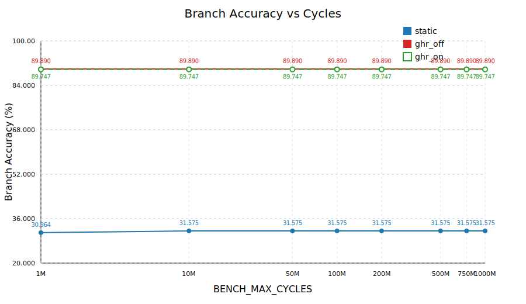
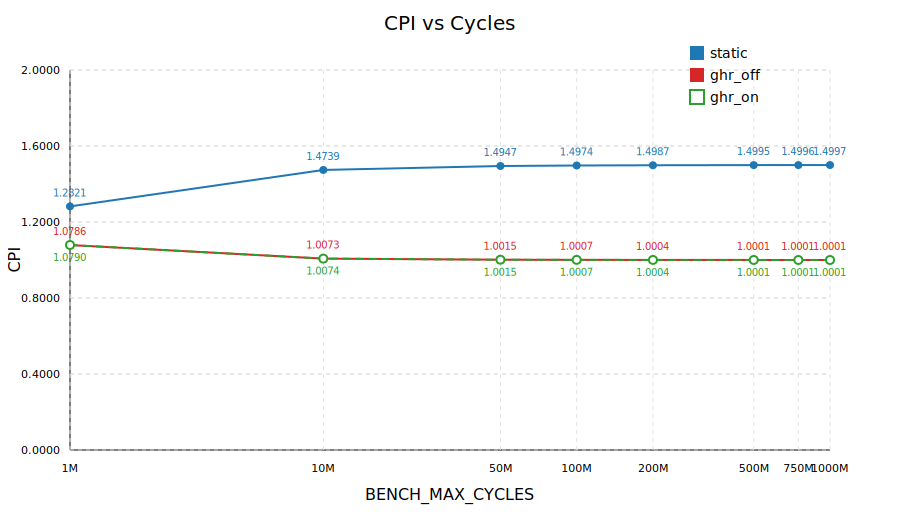
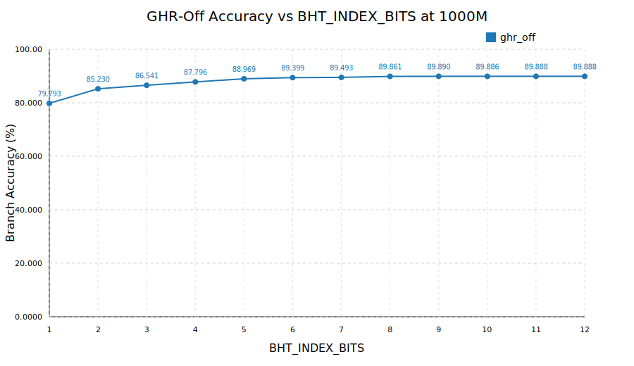
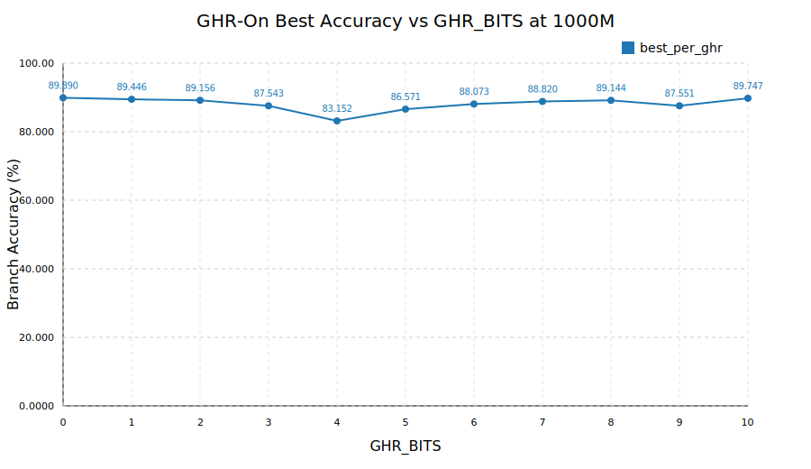
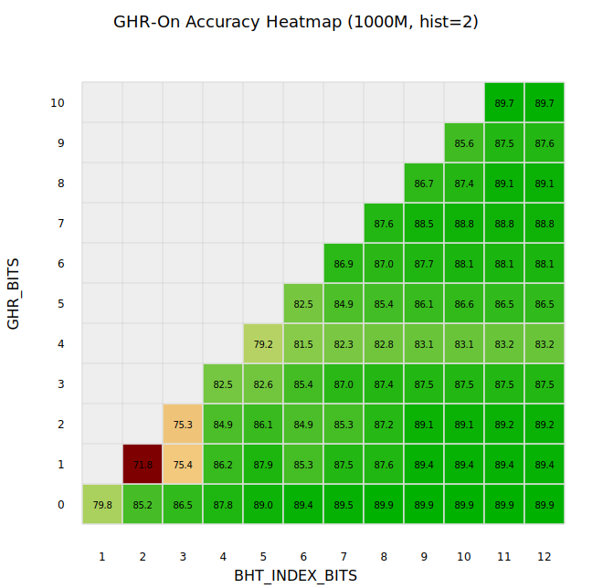

# Branch Predictor Quantification Report

This report uses the recorded `make benchmark` results under `quantification/pred/record` for the requested cycle limits: `1M`, `10M`, `50M`, `100M`, `200M`, `500M`, `750M`, and `1000M`.

## Executive Summary

- Best static baseline at `1000M`: `cycles=1000M`, `ghr=8`, `idx=10`, `hist=2`, accuracy `31.575%`, CPI `1.499735`
- Best dynamic `ghr_off` at `1000M`: `cycles=1000M`, `ghr=0`, `idx=9`, `hist=2`, accuracy `89.890%`, CPI `1.000073`
- Best dynamic `ghr_on` at `1000M`: `cycles=1000M`, `ghr=0`, `idx=9`, `hist=2`, accuracy `89.890%`, CPI `1.000073`
- Best nonzero-GHR result at `1000M`: `cycles=1000M`, `ghr=10`, `idx=11`, `hist=2`, accuracy `89.747%`, CPI `1.000073`

Compared with static prediction at `1000M`, this improves branch accuracy by `58.315` percentage points and lowers CPI by `0.499662`.

The strongest result in the current dataset is a dynamic predictor with `BHT_HISTORY_BITS=2`, `GHR_BITS=0`, and `BHT_INDEX_BITS=9`. In other words, the best-performing configuration is effectively the `ghr_off` strategy, and enabling global history does not beat it on CoreMark in this implementation.

## Figures

In the first two figures, the `ghr_on` series is drawn with dashed hollow markers because its best-per-cycle points overlap `ghr_off` exactly at `GHR_BITS=0`.

## Strategy Comparison

The cycle-by-cycle comparison shows a very clear separation between static and dynamic prediction. Static prediction stalls near `31.575%` branch accuracy and converges to roughly `1.5 CPI`, while both dynamic strategies converge near `1.0 CPI` once the benchmark prefix is long enough.

The important nuance is that the `ghr_on` family only matches the best dynamic result when `GHR_BITS=0`, which collapses back to the no-history case. That means the dynamic improvement is real, but it comes from the indexed 2-bit counter table rather than from global history correlation.

### Best Per Strategy by Cycle

#### Static

| Cycles | Config | CPI | Branch Accuracy | Mispredict Rate | Taken Rate | End Reason |
| --- | --- | ---: | ---: | ---: | ---: | --- |
| 1M | ghr=8, idx=10, hist=2 | 1.282137 | 30.964% | 69.036% | 69.036% | MAXCYCLES_TIMEOUT |
| 10M | ghr=8, idx=10, hist=2 | 1.473942 | 31.575% | 68.425% | 68.425% | MAXCYCLES_TIMEOUT |
| 50M | ghr=8, idx=10, hist=2 | 1.494715 | 31.575% | 68.425% | 68.425% | MAXCYCLES_TIMEOUT |
| 100M | ghr=8, idx=10, hist=2 | 1.497353 | 31.575% | 68.425% | 68.425% | MAXCYCLES_TIMEOUT |
| 200M | ghr=8, idx=10, hist=2 | 1.498675 | 31.575% | 68.425% | 68.425% | MAXCYCLES_TIMEOUT |
| 500M | ghr=8, idx=10, hist=2 | 1.499470 | 31.575% | 68.425% | 68.425% | MAXCYCLES_TIMEOUT |
| 750M | ghr=8, idx=10, hist=2 | 1.499646 | 31.575% | 68.425% | 68.425% | MAXCYCLES_TIMEOUT |
| 1000M | ghr=8, idx=10, hist=2 | 1.499735 | 31.575% | 68.425% | 68.425% | MAXCYCLES_TIMEOUT |

#### Dynamic, GHR Off

| Cycles | Config | CPI | Branch Accuracy | Mispredict Rate | Taken Rate | End Reason |
| --- | --- | ---: | ---: | ---: | ---: | --- |
| 1M | ghr=0, idx=9, hist=2 | 1.078560 | 89.890% | 10.110% | 68.425% | MAXCYCLES_TIMEOUT |
| 10M | ghr=0, idx=9, hist=2 | 1.007337 | 89.890% | 10.110% | 68.425% | MAXCYCLES_TIMEOUT |
| 50M | ghr=0, idx=9, hist=2 | 1.001459 | 89.890% | 10.110% | 68.425% | MAXCYCLES_TIMEOUT |
| 100M | ghr=0, idx=9, hist=2 | 1.000729 | 89.890% | 10.110% | 68.425% | MAXCYCLES_TIMEOUT |
| 200M | ghr=0, idx=9, hist=2 | 1.000364 | 89.890% | 10.110% | 68.425% | MAXCYCLES_TIMEOUT |
| 500M | ghr=0, idx=9, hist=2 | 1.000146 | 89.890% | 10.110% | 68.425% | MAXCYCLES_TIMEOUT |
| 750M | ghr=0, idx=9, hist=2 | 1.000097 | 89.890% | 10.110% | 68.425% | MAXCYCLES_TIMEOUT |
| 1000M | ghr=0, idx=9, hist=2 | 1.000073 | 89.890% | 10.110% | 68.425% | MAXCYCLES_TIMEOUT |

#### Dynamic, GHR On

| Cycles | Config | CPI | Branch Accuracy | Mispredict Rate | Taken Rate | End Reason |
| --- | --- | ---: | ---: | ---: | ---: | --- |
| 1M | ghr=0, idx=9, hist=2 | 1.078560 | 89.890% | 10.110% | 68.425% | MAXCYCLES_TIMEOUT |
| 10M | ghr=0, idx=9, hist=2 | 1.007337 | 89.890% | 10.110% | 68.425% | MAXCYCLES_TIMEOUT |
| 50M | ghr=0, idx=9, hist=2 | 1.001459 | 89.890% | 10.110% | 68.425% | MAXCYCLES_TIMEOUT |
| 100M | ghr=0, idx=9, hist=2 | 1.000729 | 89.890% | 10.110% | 68.425% | MAXCYCLES_TIMEOUT |
| 200M | ghr=0, idx=9, hist=2 | 1.000364 | 89.890% | 10.110% | 68.425% | MAXCYCLES_TIMEOUT |
| 500M | ghr=0, idx=9, hist=2 | 1.000146 | 89.890% | 10.110% | 68.425% | MAXCYCLES_TIMEOUT |
| 750M | ghr=0, idx=9, hist=2 | 1.000097 | 89.890% | 10.110% | 68.425% | MAXCYCLES_TIMEOUT |
| 1000M | ghr=0, idx=9, hist=2 | 1.000073 | 89.890% | 10.110% | 68.425% | MAXCYCLES_TIMEOUT |

## `ghr_off` Parameter Sweep

At `1000M`, sweeping only `BHT_INDEX_BITS` with `GHR_BITS=0` and `BHT_HISTORY_BITS=2` shows strong early gains from increasing table size, then clear saturation. The worst point is `idx=1` at `79.793%`, while the best point is `idx=9` at `89.890%`, a gain of `10.097` percentage points.

The main transition happens between `idx=1` and `idx=8`. After that, the curve flattens: `idx=8`, `idx=9`, `idx=10`, `idx=11`, and `idx=12` are all effectively tied. This suggests the aliasing problem is mostly solved by about `2^9` entries, and larger tables bring little measurable CoreMark benefit.

## `ghr_on` Parameter Sweep

The best nonzero-GHR point at `1000M` is `ghr=10`, `idx=11`, `hist=2` with `89.747%` accuracy. That is still `0.143` percentage points below the best `ghr_off` result.

The 3D figure and heatmap show that the global-history surface is uneven: some larger `GHR_BITS` values recover part of the lost accuracy, but none beat the no-history optimum. The worst valley appears around small nonzero GHR widths with undersized index spaces, where XOR history introduces extra aliasing without enough table capacity to separate branch behaviors.

A useful reading of the surface is:

- `ghr=0` is the dominant ridge, which confirms the benchmark prefers PC-indexed local behavior in this predictor design.
- Small nonzero GHR values often hurt because they consume index entropy while adding noisy shared history.
- Very large GHR values can recover some accuracy when paired with larger `idx`, but the best nonzero case still does not surpass the simpler `ghr_off` predictor.

### Top `ghr_on` Configurations at `1000M`

| Rank | GHR | IDX | HIST | Accuracy | CPI | Mispredict Rate |
| --- | ---: | ---: | ---: | ---: | ---: | ---: |
| 1 | 0 | 9 | 2 | 89.890% | 1.000073 | 10.110% |
| 2 | 0 | 11 | 2 | 89.888% | 1.000073 | 10.112% |
| 3 | 0 | 12 | 2 | 89.888% | 1.000073 | 10.112% |
| 4 | 0 | 10 | 2 | 89.886% | 1.000073 | 10.114% |
| 5 | 0 | 8 | 2 | 89.861% | 1.000073 | 10.139% |
| 6 | 10 | 11 | 2 | 89.747% | 1.000073 | 10.253% |
| 7 | 10 | 12 | 2 | 89.741% | 1.000073 | 10.259% |
| 8 | 0 | 7 | 2 | 89.493% | 1.000074 | 10.507% |
| 9 | 1 | 11 | 2 | 89.446% | 1.000074 | 10.554% |
| 10 | 1 | 12 | 2 | 89.446% | 1.000074 | 10.554% |
| 11 | 1 | 9 | 2 | 89.446% | 1.000074 | 10.554% |
| 12 | 1 | 10 | 2 | 89.446% | 1.000074 | 10.554% |

## Interpretation

The data says the CoreMark branch stream in this setup is highly amenable to a reasonably sized 2-bit BHT indexed by PC alone. That is why `ghr_off` wins: it avoids history-induced aliasing and already captures the dominant bias and loop behavior.

CPI becomes a weak discriminator once the cycle limit is very large, because all good dynamic configurations approach `1.0 CPI`. Branch accuracy is therefore the better optimization metric here, with CPI mainly confirming that misprediction penalties shrink as the predictor improves.

Because every row in the current dataset ends with `SIM_END_REASON=MAXCYCLES_TIMEOUT`, these are still fixed-prefix measurements rather than true full-program completion measurements. The conclusions are therefore about the first `N` simulated cycles of CoreMark, not about a completed benchmark run. Even so, the ordering is very stable from `10M` onward, which makes the design ranking convincing.

## Optimized Conclusion

The recommended predictor from the current data is:

- Strategy: dynamic prediction with GHR disabled
- Parameters: `GHR_BITS=0`, `BHT_INDEX_BITS=9`, `BHT_HISTORY_BITS=2`
- `1000M` result: `89.890%` branch accuracy, `1.000073` CPI

Why this is the best choice:

- It gives the highest observed branch accuracy in the dataset.
- It matches the best CPI tier.
- It reaches the accuracy plateau without oversizing the BHT unnecessarily.
- It is simpler than the `ghr_on` alternatives and empirically more robust on CoreMark.

If you want a practical hardware default from this study, set the predictor to `ghr_off`, `idx=9`, `hist=2`. If you later want to rescue `ghr_on`, the next step is not to increase GHR blindly. The next step is to redesign the indexing or table structure so history does not destroy useful PC locality.
